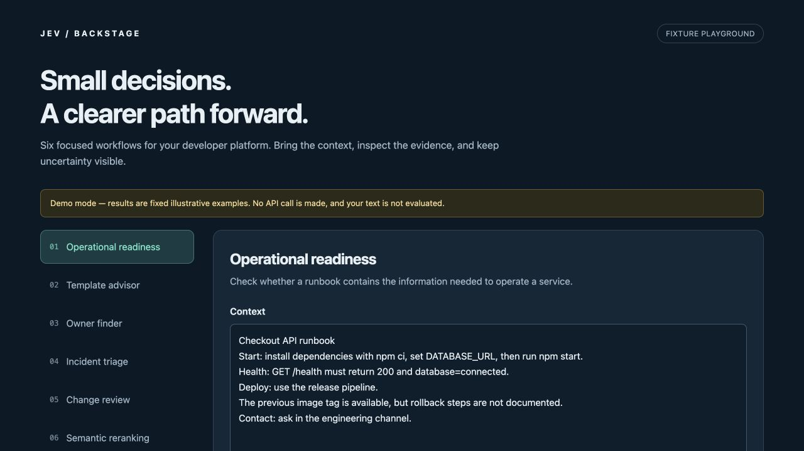

# Jev for Backstage

Six focused decision workflows for [Backstage](https://backstage.io), powered by [TypeSafe Jev](https://docs.typesafe.ai/introduction). Evaluate operational documentation, choose templates and teams, triage incidents, inspect changes, and rerank catalog candidates from one workbench.

**Status: experimental v0.1.0.** Real Jev integration, authenticated Backstage backend, legacy and new frontend extensions, and a key-free fixture playground. No generated explanations or autonomous infrastructure changes.



## Workflows

| Workflow | Input | Output |
| --- | --- | --- |
| Operational readiness | A runbook, README, or TechDocs excerpt | Separate checks for startup, health verification, rollback, and escalation |
| Template advisor | Service requirements and catalog templates | One suggested template, or no match |
| Owner finder | A service or issue description and catalog groups | One suggested team, or no match |
| Incident triage | Observed symptoms and customer impact | Reported impact and an investigation area; uncertainty stays visible |
| Change review | A change description, diff, and rollout context | Compatibility, data migration, access control, and rollback checks |
| Semantic reranking | A question and a shortlist of entities or document excerpts | Ordered relevance scores, distributions, and confidence |

Template, ownership, and search workflows can load up to 20 entries through the user's Backstage Catalog API. An optional keyword filter narrows that shortlist. Edit the descriptions or add candidates manually before evaluation. Results link back to their catalog entities.

## Try the interface

Node.js 22 or newer:

```sh
git clone https://github.com/namayasai/backstage-jev.git
cd backstage-jev
npm ci
npm run dev
```

Open the localhost URL, choose a workflow, and click **Load example input**, then **Show example result**. This playground deliberately uses fixed fixtures: it does not call Jev or judge edited text. Live evaluation is available through the Backstage backend and the smoke-test command below.

The repository's `.npmrc` uses `legacy-peer-deps` because Backstage's optional test peer dependencies produce conflicting React type resolutions under npm. Runtime React is pinned to 18 through root overrides; TypeScript and integration adapter tests check the installed versions. Use your Backstage application's existing package manager when integrating.

## Install in Backstage

See [the installation guide](docs/installation.md) for package installation, frontend registration, the entity tab, permissions, and configuration. Packages are distributed as GitHub Release tarballs; **they are not published to npm**.

Backend configuration:

```yaml
jev:
  apiKey: ${TYPESAFE_API_KEY}
  model: jev-1.13.0
  confidenceThreshold: 0.8
  timeoutMs: 15000
  requestsPerMinute: 10
```

The key is marked secret in the Backstage config schema. It stays on the backend. Calls go only to `https://api.typesafe.ai/v1/systemone`, with redirects rejected. Requests require a signed-in user and the `jev.evaluate` permission. The plugin does not store submitted documents or results.

## Development and verification

```sh
npm run check          # typecheck, tests, package builds, playground build
npm run pack:plugins   # three installable tarballs in dist/packages
npm run test:live -- --key-file /absolute/path/to/a/raw-key-file
```

Alternatively, set `TYPESAFE_API_KEY` in your environment and run `npm run test:live`. The live test sends only the synthetic examples defined in `scripts/live-smoke.ts` and writes a sanitized report to `docs/live-smoke.json`. It makes eight API calls and does not print or copy the key. Live tests are opt-in and never run in CI.

See [verification details](docs/verification.md) and the [live smoke report](docs/live-smoke.json). Small synthetic examples establish connectivity and basic behavior, not production accuracy.

## Structure

```text
plugins/jev-common/   Typed workflows, input/output validation, thresholds, permission
plugins/jev-backend/  Authenticated API, rate limits, Jev transport, configuration
plugins/jev/          Workbench, catalog adapter, legacy and new frontend extensions
examples/playground/ Standalone fixture UI using the same workbench component
```

The six workflows share one backend and UI package so installations need only one API key and one authorization policy. Each workflow is independently selected by its ID. The shared `buildEvaluation` and `summarize` functions can also support future Tech Insights or Scaffolder adapters.

## Boundaries of this release

- Runbooks and diffs are pasted into the workbench. Automatic TechDocs ingestion, GitHub PR fetching, scheduled scoring, and Tech Insights/Soundcheck adapters are not implemented.
- Reranking evaluates the supplied shortlist. It does not replace Backstage Search or search every catalog entry.
- Recommendations do not run templates, update owners, page responders, approve changes, or deploy software.
- Noul values are probabilities of a statement; they are **not** confidence scores. Values between 0.2 and 0.8 require review. Choice and Score use a separate configurable confidence threshold, initially 0.8. These defaults need evaluation against your own data.
- Jev can make incorrect judgments, including confident ones. Missing evidence is not proof that a service is safe or unsafe. Context and candidate descriptions are untrusted input; adversarial content can influence a model.
- The UI and test corpus are English. Jev accepts other languages, but this release does not claim Japanese quality has been evaluated.
- Limits are per backend process (four simultaneous evaluations, bounded per-user rate buckets). Multi-instance deployments should also apply shared rate limiting at their gateway.

Implementation follows the official [API contract](https://docs.typesafe.ai/api), [confidence guidance](https://docs.typesafe.ai/confidence), and [documented Jev limitations](https://docs.typesafe.ai/model-jaggedness/jev-1.13).

## License

Apache-2.0. This is an independent community project, not an official TypeSafe or Backstage plugin.
