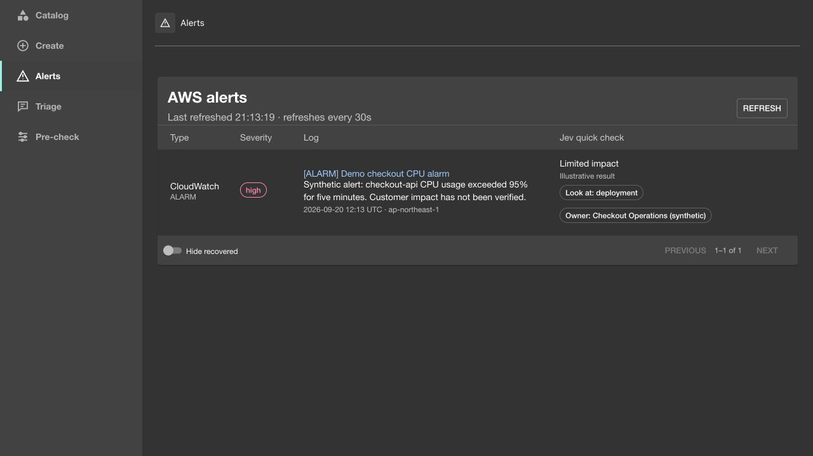
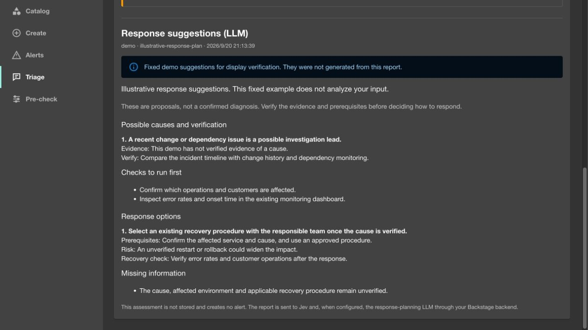
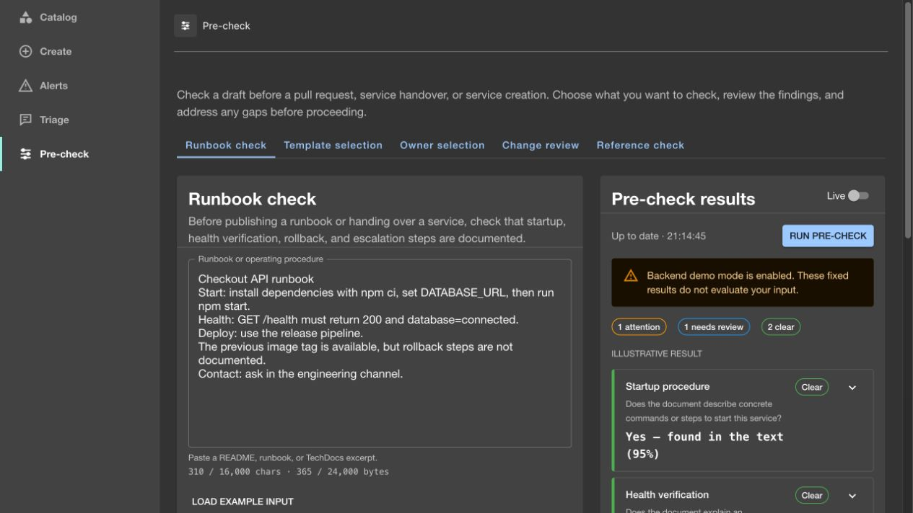

# Jev Operations Support for Backstage

Six focused decision workflows for [Backstage](https://backstage.io), powered by [TypeSafe Jev](https://docs.typesafe.ai/introduction). Evaluate operational documentation, choose templates and teams, triage incidents, inspect changes, and rerank catalog candidates from one workbench.

**Status: experimental. Current release 0.4.0, covering all five packages.** Version 0.2.0 was verified in a local Backstage 1.55.0 host with all six workflows calling the real Jev API, and 0.3.0 adds a separately recorded integration run. Includes an authenticated backend, legacy and new frontend extensions, a key-free fixture playground, and the opt-in integrations described below. Optional LLM response suggestions follow incident triage; no infrastructure actions are executed.

Version 0.4.0 adds separate Alerts, Triage and Pre-check pages, task-specific workflow tabs, scheduled entity cards, PR change review, and optional LLM response suggestions. See the [changelog](CHANGELOG.md).

The following screenshots show the current source in a local Backstage host using synthetic data and fixed demo results. They demonstrate the interface, not live model accuracy.

**Alerts — received notifications with severity and a Jev summary.**



**Triage — separate LLM response suggestions after incident assessment.**



**Pre-check — review a draft runbook before publishing or handing it over.**



## Workflows

| Workflow | Input | Output |
| --- | --- | --- |
| Operational readiness | A runbook, README, or TechDocs excerpt | Separate checks for startup, health verification, rollback, and escalation |
| Template advisor | Service requirements and catalog templates | One suggested template, or no match |
| Owner finder | A service or issue description and catalog groups | One suggested team, or no match |
| Incident triage | Observed symptoms and customer impact | Reported impact and an investigation area; uncertainty stays visible |
| Change review | A change description, diff, and rollout context | Compatibility, data migration, access control, and rollback checks |
| Semantic reranking | A question and a shortlist of entities or document excerpts | Ordered relevance scores, distributions, and confidence |

Template, ownership, and search workflows can load up to 20 entries through the user's Backstage Catalog API. An optional keyword filter narrows that shortlist. Edit the descriptions or add candidates manually before evaluation. Results link back to their catalog entities.

The template advisor and semantic reranking workflows are also available as standalone components, placed where that decision is actually made rather than on a separate page: `JevTemplateAdvisor` (a recommendation card, any page) and `JevRerankedResults` (reorders a Backstage search page's results in place of `<SearchResult>`, needs the optional `@backstage/plugin-search-react` peer dependency). See the installation guide's "Search and Scaffolder integrations" section.

## Try the interface

Node.js 22 is the verified runtime:

```sh
git clone https://github.com/namayasai/backstage-jev-operations-support.git
cd backstage-jev-operations-support
npm ci
npm run dev
```

Open the localhost URL. The standalone demo opens on an alert table; the **Pre-check** tab lets you try any of the other five workflows by hand, either by choosing "Run pre-check" or by turning on the Live switch to check input as you edit it (Live is off by default, opt-in per browser, same as in a real Backstage instance). This playground deliberately uses fixed fixtures: it does not call Jev or judge edited text. Live evaluation is available through the Backstage backend and the smoke-test command below.

The repository's `.npmrc` uses `legacy-peer-deps` because Backstage's optional test peer dependencies produce conflicting React type resolutions under npm. Runtime React is pinned to 18 through root overrides; TypeScript and integration adapter tests check the installed versions. Use your Backstage application's existing package manager when integrating.

## Install in Backstage

See [the installation guide](docs/installation.md) for package installation, frontend registration, the entity tab, permissions, and configuration. All five packages are published on npm at 0.4.0: frontend, backend, shared, and the two optional backend modules. GitHub Release tarballs are also available. The shared package installs automatically with the frontend or backend. The [Plugin Directory submission](https://github.com/backstage/backstage/pull/35788) tracks the upstream review.

The two optional backend modules are installed by name alongside the matching 0.4.0 backend, since they import its `/client` export; see [optional modules](docs/installation.md#5-optional-modules).

Backend configuration:

```yaml
jevOperationsSupport:
  apiKey: ${TYPESAFE_API_KEY}
  model: jev-1.13.0
  confidenceThreshold: 0.8
  timeoutMs: 15000
  requestsPerMinute: 10
```

The key is marked secret in the Backstage config schema. It stays on the backend. Calls go only to `https://api.typesafe.ai/v1/systemone`, with redirects rejected. Requests require a signed-in user and the `jev-operations-support.evaluate` permission. The plugin does not store submitted documents or results; the only data this project persists is described in the AWS alert boundary below.

## Development and verification

```sh
npm run check          # typecheck, tests, package builds, playground build
npm run pack:plugins   # five installable tarballs in dist/packages
npm run test:live -- --key-file /absolute/path/to/a/raw-key-file
# Optional labeled Japanese/mixed-language evaluation (calls the real API)
npm run eval:live -- --key-file /absolute/path/to/a/raw-key-file --repeat 3
```

Alternatively, set `TYPESAFE_API_KEY` in your environment and run either command. `test:live` sends only the eight synthetic examples defined in `scripts/live-smoke.ts`; it is a schema/connectivity smoke test and does not establish model accuracy. `eval:live` uses the small synthetic fixtures with explicit expected labels in [docs/evaluation-fixtures.json](docs/evaluation-fixtures.json), reports each check, expected-label matches, and review rate, and accepts an optional `--repeat N` for stability observations. Both commands write sanitized reports and never print or copy the key. Live tests are opt-in and never run in CI.

See [verification details](docs/verification.md) and the [live smoke report](docs/live-smoke.json). Small synthetic examples establish connectivity and basic behavior, not production accuracy.

The [Backstage host report](docs/backstage-host-smoke.json) records browser-to-backend-to-Jev checks for all six workflows. [Publishing status and the directory submission procedure](docs/publishing.md) are tracked separately.

## Structure

```text
plugins/jev-operations-support-common/           Typed workflows, input/output validation, thresholds, permission
plugins/jev-operations-support-backend/          Authenticated API, rate limits, Jev transport, GitHub webhook, /client export
plugins/jev-operations-support/                  Workbench, AWS alert inbox, read-only entity cards, catalog adapter, legacy and new frontend extensions
plugins/jev-operations-support-tech-insights/    Optional Tech Insights fact retrievers: readiness evidence, ownerless-entity owner suggestion
plugins/jev-operations-support-aws-notifications/ Optional CloudWatch alert module
examples/playground/                             Standalone fixture UI using the same workbench component
```

The six workflows share one backend and UI package so installations need only one API key and one authorization policy. Each workflow is independently selected by its ID. The optional modules reuse the same `buildEvaluation`, `summarize`, and Jev client through the backend's `/client` export rather than adding a second transport or key.

In Backstage, **Alerts**, **Triage**, and **Pre-check** have separate sidebar entries. Triage checks human incident reports; [optional LLM response planning](docs/response-planning.md) proposes next steps after Jev for human reports and received alarms. Alerts shows notification type, severity, log content and a Jev summary; selecting a row opens the details. Pre-check uses workflow tabs to review a draft before a pull request, handover, owner assignment, or service creation. Each workflow names the input it needs and shows findings to address before proceeding.

## Optional integrations

All four are opt-in, inactive until configured, and reuse the same key, model, and `confidenceThreshold`:

| Integration | What it does |
| --- | --- |
| Entity TechDocs loading | Loads a selected TechDocs page through the signed-in user's fetch API into the editable context. Never evaluates automatically. |
| [Tech Insights facts](docs/tech-insights.md) | A scheduled fact retriever for entities that carry an explicit opt-in annotation, plus an example JSON-rules check. Separate fetch, evaluation, and evidence states; no health score. A second, independently opt-in retriever suggests a responsible catalog Group for entities with no real owner; it never reads documentation and never writes `spec.owner`. Two read-only entity cards (`EntityJevReadinessCard`, `EntityJevOwnerSuggestionCard`) show these retrievers' latest scheduled results on the entity page — no Live switch, no evaluation triggered from the card. |
| [GitHub PR webhook](docs/github-webhook.md) | A signature-verified pull request webhook that evaluates changed Markdown documents, plus an opt-in `change-risk` review of the pull request diff itself. |
| [AWS CloudWatch alerts](docs/aws-notifications.md) | CloudWatch → SNS → SQS → Backstage Events → Notifications, with a receive-time Jev incident assessment, an inbox in the frontend, and a local manual re-check. Adds one plugin-owned table and one authenticated read endpoint. |

With `jevOperationsSupport.demoMode: true`, no integration calls the provider even when a key is configured: the webhook refuses with 503, and the Tech Insights and AWS modules record honest not-evaluated results rather than storing fixtures.

## Boundaries of this release

- TechDocs loading is manual: the entity workbench loads a selected page, strips non-document HTML, and places the result in the editable context for review before an explicit evaluation.
- The optional integrations above are the only automatic evaluation paths, and each is off until configured. There is no Soundcheck adapter and no scheduled scoring outside the Tech Insights retriever's own cadence.
- AWS alert delivery is best effort. The standard SQS publisher deletes a batch without awaiting subscribers and the standard Events service swallows subscriber errors, so this module cannot guarantee redelivery if Notifications storage fails. A Jev failure never removes the alert that was already saved. See [the AWS guide](docs/aws-notifications.md).
- The AWS module is the only part of this project that stores data. Backstage Notifications does not persist `payload.metadata`, so the alarm context and the receive-time Jev result are kept in one table (`jev_aws_alert_details`) in the Backstage database the host already provides to this plugin, for 30 days after their last write. Expired details are excluded from reads and removed in scheduled batches. Everything else — recipients, inbox identity, read and saved state — stays with standard Notifications, and an alert whose stored details are gone is still shown as an alert.
- Reranking evaluates the supplied shortlist. It does not replace Backstage Search or search every catalog entry.
- Recommendations do not run templates, update owners, page responders, approve changes, or deploy software.
- Noul values are probabilities of a statement; they are **not** confidence scores. Values between 0.2 and 0.8 require review. For change-risk compatibility, migration, and access checks, a low value means the concern was not established by the supplied text and remains `review`; it is not a safety pass. Choice and Score use a separate configurable confidence threshold, initially 0.8. These defaults need evaluation against your own data.
- Jev can make incorrect judgments, including confident ones. Missing evidence is not proof that a service is safe or unsafe. Context and candidate descriptions are untrusted input; adversarial content can influence a model.
- The repository includes a small labeled Japanese, mixed-language, negation, implicit-evidence, and insufficient-input fixture set. It is an opt-in evaluation aid, not a quality guarantee or benchmark.
- Limits are per backend process (four simultaneous interactive evaluations, ten concurrent AWS receive-time evaluations, bounded per-user rate buckets). None of these counters is shared between instances or survives a restart, so multi-instance deployments should also apply shared rate limiting at their gateway.

Implementation follows the official [API contract](https://docs.typesafe.ai/api), [confidence guidance](https://docs.typesafe.ai/confidence), and [documented Jev limitations](https://docs.typesafe.ai/model-jaggedness/jev-1.13).

## License

Apache-2.0. This is an independent community project, not an official TypeSafe or Backstage plugin.
